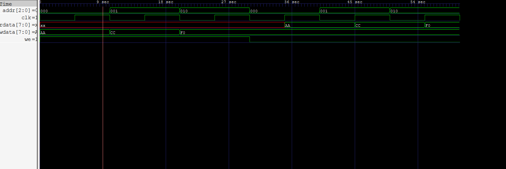

# 8x8 RAM using Verilog HDL

## 📌 Project Overview

This project implements an 8x8 Random Access Memory (RAM) using Verilog HDL.

The RAM contains:
- 8 memory locations
- 8-bit data storage in each location
- 3-bit address input
- Synchronous read and write operations

## 🧠 RAM Architecture

Since there are 8 memory locations:

2³ = 8

Therefore, a 3-bit address is required.

Each memory location stores 8 bits of data.

## 🔌 Inputs and Outputs

| Signal | Direction | Width | Description |
|--------|-----------|-------|-------------|
| clk | Input | 1 bit | Clock signal |
| we | Input | 1 bit | Write Enable |
| addr | Input | 3 bits | Memory address |
| wdata | Input | 8 bits | Data to write |
| rdata | Output | 8 bits | Data read from RAM |

## ⚙️ Operation

### Write Operation

When:

we = 1

The input data is stored at the selected address.

Example:

addr = 000  
wdata = 10101010

The RAM stores:

memory[0] = 10101010

### Read Operation

When:

we = 0

The data stored at the selected address is provided at `rdata`.

## 🧪 Simulation

The design was simulated using:

- Icarus Verilog
- GTKWave

### Simulation Flow

Verilog Design → Testbench → Icarus Verilog → VCD File → GTKWave

## 📂 Project Files

- `ram_8x8.v` — RAM design
- `tb_ram_8x8.v` — Testbench
- `ram_8x8.vcd` — Simulation waveform data

## 📊 Waveform

GTKWave was used to verify the following signals:

- `clk`
- `we`
- `addr`
- `wdata`
- `rdata`
- 
The RAM was simulated using Icarus Verilog and the output waveform was verified using GTKWave.

## 📚 What I Learned

- Verilog module design
- Memory array declaration
- Read and write operations
- Testbench creation
- Clock generation
- Verilog simulation using Icarus Verilog
- Waveform analysis using GTKWave
- Basic GitHub project management

## 🚀 Future Improvements

- Add reset functionality
- Add separate read/write control
- Create parameterized RAM
- Implement larger RAM designs
